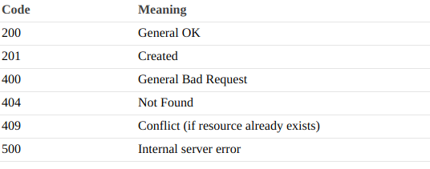

Sessió 2
=========

A la darrera sessió vam conèixer alguns conceptes nous relacionats amb les API i com crear diferents punts finals ('endpoints') per crear i modificar dades. Però, com ja heu notat, hem utilitzat el diccionari com a emmagatzematge i aquest tipus d’estructura no ens permet mantenir la persistència de les dades de les nostres modificacions.

En aquesta sessió, afegirem la persistència de dades mitjançant un sistema de base de dades definit i gestionat pels mòduls de Flask, modificarem els nostres mètodes GET, POST, PUT i DELETE per gestionar espectacles, llocs i artistes amb persistència de dades i crearem nous mètodes per gestionar els `Artists` dins d `Shows (Shows.Artists)`. Finalment, també afegirem nous endpoints relacionats amb aquests nous mètodes.

SQLAlchemy: definició de l'estructura de dades mitjançant models
------------------------------------------------

Els models de dades s’utilitzen en diferents aplicacions que gestionen l’emmagatzematge de dades i determinen com es poden organitzar i manipular les dades. Els més populars són els models relacionals, que utilitzen un format basat en taules.

### Configuració SQLAlchemy

Per tal de crear models a la part superior de la nostra base de dades (ORM), utilitzarem un paquet Python anomenat SQLAlchemy. SQLAlchemy ens permet emmagatzemar i recuperar dades mitjançant objectes orientats a objectes amb la seva classe Model. Aquesta classe converteix les dades en objectes Python obtenint un codi compatible amb diferents bases de dades relacionals.
Al nostre projecte, utilitzarem Flask SQLAlchemy, que és un paquet especialitzat relacionat amb SQLAlchemy que ens proporciona detalls de funció per a les aplicacions de Flask.
Per utilitzar aquest nou paquet l’haurem d’instal·lar:

    pip install Flask-SQLAlchemy


I afegiu algunes línies de codi al nostre projecte:

-   Creeu un fitxer `db.py` en el projecte principal (mateixa carpeta que `app.py`)
amb aquest contingut:

    ```python
    from flask_sqlalchemy import SQLAlchemy

            db = SQLAlchemy()
    ```

-   Importeu `db` en el fitxer `app.py`:

    ```python
    from db import db
    ```

-   Afegiu alguns paràmetres de configuració a `app.py` amb `SQLALCHEMY_DATABASE_ URI` per a definir on es guarda les dades (en el nostre  cas usarem SQLite en un fitxer anomenat `data.db` en el projecte principal) i `SQLALCHEMY_TRACK_MODIFICATIONS` posat a False per evitar despeses importants que consumeixen memòria. Probablement, en les noves versions de Flask, ja estigui configurat com a Fals per defecte, però és millor assegurar-ho.


Afegiu aquesta configuració després de
 `app = Flask(__name__)`

```python
app.config['SQLALCHEMY_DATABASE_URI'] = 'sqlite:///data.db'
app.config['SQLALCHEMY_TRACK_MODIFICATIONS'] = False
```

SQLAlchemy llegirà la configuració de la nostra aplicació i es connectarà automàticament a la nostra base de dades.

### Definint ArtistModel

En primer lloc, crearem una carpeta `models` al projecte principal per obtenir tots els fitxers de models que hi ha.

En la carpeta `models` creeu  un arxiu `artist.py` on definirem la classe model `ArtistModel` per a interactuar amb l'API  `artist`. Per a importar la base de dades feu:

```python
from db import db
```

Prenent com a referència l’estructura de dades de la sessió anterior, crearem una taula d’artistes amb 4 variables de classe
(`id, name, country, discipline`) corresponent a les diferents columnes de la taula.
Definirem l'estructura "ArtistModel" que defineix el nom de la taula, el nom, el tipus i el nombre de columnes, com ara:

```python
class ArtistModel(db.Model):
    __tablename__ = 'artists' #This is table name

    id = db.Column(db.Integer, primary_key=True)
    name = db.Column(db.String(30))
    country = db.Column(db.String(30))
    discipline = db.Column(db.Enum(*disciplines))
```

Mireu aquesta estructura:

-   `id` es defineix com a  `Integer` i `primary_ key= True`. Això indica que aquest valor s'utilitzarà per enllaçar amb altres taules (en el nostre cas, un enllaç entre "artistes" i "espectacles"). Aquest valor es defineix com a`UNIQUE` per defecte. En cas contrari, no estarem segurs de quin esdeveniment està relacionat amb quin artista.

-   `name` i `country` estan definits com a `String` amb una mida màxima de 30. No és obligatori definir una longitud màxima però es recomana.

-   `discipline` es defineix com a `Enum`, 
que indica que només pot tenir els valors definits en una enumeració. En el nostre cas, definirem aquesta enumeració com a tupla Python:

    ```python
    disciplines = ('THEATRE', 'MUSIC', 'DANCE', 'CIRCUS', 'OTHER')
    ```

Afegeix `disciplines` in `artist.py` abans de  la definició d' ArtistModel.
En aquesta versió d’estructura només tindrem una disciplina per artista per simplificar el nostre model.
 
Finalment, afegirem alguns paràmetres de configuració més a les nostres columnes:

```python
name = db.Column(db.String(30), unique = True, nullable=False)
```

-   `unique = True`: evita tenir dos artistes amb el mateix nom a la nostra base de dades

-   `nullable = False`: no permet tenir valors buits en aquesta columna

També podem definir alguns mètodes relacionats amb aquesta taula en funció de les nostres necessitats, però és obligatori definir un mètode `__ init__` per definir com es creen els objectes. Afegiu aquest mètode a ArtistModel:

```python
def __init__(self, name, country, discipline):
        self.name = name
        self.country = country
        self.discipline = discipline
```

Fixeu-vos que no cal inicialitzar l'identificador, SQLAlchemy ho farà quan desem aquest tipus de dades a la base de dades.
### Exercise 1: 

Definiu també `country` i `discipline` com a  no `nullable`.

### Definiu ShowModel i PlaceModel

### Exercise 2.1: 

1.  Definiu la classe `ShowModel` a `show.py` dins de la carpeta `models`, amb la taula anomenada `shows` amb aquests paràmetres:

    -   `id` (Integer and primary_key)

    -   `name` (String)

    -   `date` (DateTime)

    -   `price` (Float)


2.  Definiu tots aquests paràmetres com a no `nullable`.

3.  Definiu els mètodes `__init__`.

4.  Definiu una `UniqueConstraint` per a evitar l'existència d'un espectacle amb el mateix (`’name’,’date’,’price’`) afegint a ShowModel sota el nom de la taula:

    ```python
    __table_args__ = (db.UniqueConstraint('name', 'date', 'price'),)
    ```
    ### Exercise 2.2: 
    

1.  Definiu la classe `PlaceModel` a `place.py` dins de la carpeta `models`, amb la taula anomenada `places` amb aquests paràmetres:

    -   `id` (Integer and primary_key)

    -   `name` (String)

    -   `city` (String)

    -   `country` (String)
    
    -   `capacity` (Integer)


2.  Definiu tots aquests paràmetres com a no `nullable`.

3.  Definiu els mètodes `__init__`.

4.  Definiu una `UniqueConstraint` per a evitar l'existència d'un lloc amb el mateix (`’name’,’city’,’country’,'capacity'`) afegint-ho a PlaceModel:

    ```python
    __table_args__ = (db.UniqueConstraint('name', 'city', 'country','capacity'),)
    ```

### Definint relacions entre models

Les relacions entre models a SQLAlchemy són enllaços entre dos o més models que permeten als models referenciar-se automàticament.
Per a la relació entre shows i artistes definirem un tipus de relació anomenada "Molts a molts". Aquest tipus de relació ens permetrà que un artista participi en molts espectacles i que un espectacle pugui tenir més d'un artista. Per a la relació de ShowModel amb PlaceModel farem servir una relació molta a 1, ja que un Show es farà només en una localització i una mateixa localització podrà allotjar diferents espectacles en diferents dates. 

### Exercise 3: 

Mireu aquesta definició de relació de molts a molts i definiu-ne un
relació de molts a molts entre ArtistModel i ShowModel. En el nostre cas, el nom de la relació a ShowModel és "artists" i el backref és "shows". 

### Many-to-many example:
```python

artists_in_events = db.Table('artists_in_events',
                             db.Column('id', db.Integer, primary_key=True),
                             db.Column('artist_id', db.Integer, db.ForeignKey('artists.id')),
                             db.Column('event_id', db.Integer, db.ForeignKey('events.id')))

class EventModel(db.Model):
    __tablename__ = 'events'

    id = db.Column(db.Integer, primary_key=True)
    date = db.Column(db.String(10))
    name = db.Column(db.String(30))
    city = db.Column(db.String(30))
    country = db.Column(db.String(30))
    artists = db.relationship("ArtistModel",secondary=artists_in_events,backref=db.backref('events'))
    
    
```
Mireu aquesta definició de relació de molts a 1 i definiu-ne un
relació de 1 a molts entre PlaceModel i ShowModel. En el nostre cas, el nom de la relació a ShowModel és "place" i la ForeingKey place_id. 


### Many-to-One example

```python
class Parent(Base):
    __tablename__ = 'parent'
    id = Column(Integer, primary_key=True)
    child_id = Column(Integer, ForeignKey('child.id'))
    child = relationship("Child")

class Child(Base):
    __tablename__ = 'child'
    id = Column(Integer, primary_key=True)
```


Migracions: creació / actualització de la nostra estructura d’emmagatzematge de dades
---------------------------------------------------------

A la secció anterior hem definit el nostre magatzem de dades mitjançant Models, però per poder utilitzar-lo hem de crear-lo a la base de dades. El podem fer "a mà" al nostre codi, creant taules utilitzant ordres SQL. Però podem fer un pas més amb Flask-Migrate.
Flask-Migrate proporciona una manera de fer front als canvis en l'esquema de la base de dades
usant SQLAlchemy, utilitzant només unes poques ordres a la línia de comandes.

### Configure Flask-Migrate

Com sempre, abans d’utilitzar aquest paquet de Flask l’hem d’instal·lar:

    pip install Flask-Migrate

I afegiu-hi algunes línies a `app.py`:

```python
from flask_migrate import Migrate
```

Assegureu-vos que el vostre fitxer principal s'anomeni "app.py" perquè
flask-migrate està buscant aquest fitxer. A més, s’importen els nostres models
allà:

```python
 from models.artist import ArtistModel
 from models.show import ShowModel  #also import table created with many-to-many relationship
```

Afegiu `Migration` i la inicialització del ORM SqlAlchemy després de tots els `app.config`:

```python
migrate = Migrate(app, db)
db.init_app(app)
```

A les següents seccions anem a treballar-hi. Assegureu-vos que heu desat totes les modificacions abans d’executar les nostres ordres de migració.

### Executeu migracions

Obriu el terminal mitjançant PyCharm o Terminal a la carpeta principal i executeu aquestes ordres:

    flask db init

Això afegirà una carpeta de migracions a la vostra aplicació. Si voleu fer control de versions de les migracions fetes, cal afegir el contingut d’aquesta carpeta al control de versions juntament amb els altres fitxers font.

A continuació, podeu generar una migració inicial:

    flask db migrate -m "Initial migration".


A continuació, podeu aplicar la migració a la base de dades:

    flask db upgrade

Després, **cada vegada que canvien els models de base de dades**, repetiu els dos passos anteriors amb un missatge diferent. Penseu però que cada vegada que canvieu el model de la base de dades heu de pensar què fareu amb les dades que ja existeixen però que puguin ser incompatibles amb el nou model de dades (per exemple un camp passa ser no null i teniu dades amb aquest camp a null). Les podeu o bé eliminar o bé actualitzar-les amb dades que les facin compatibles amb el nou esquema.  

Per veure totes les ordres disponibles, executeu aquesta ordre:

    flask db --help

### Afegint dades

En aquest moment tenim un emmagatzematge de dades buit a punt per utilitzar. Utilitzarem la línia de comandes de flask (PyCharm o Terminal) per aprendre a afegir-ne, modificar-la i suprimir-ne informació. També és important saber construir la nostra consulta per obtenir la informació desitjada.
Obriu Flask Shell escrivint `flask shell` al terminal o PyCharm
Terminal (assegureu-vos de fer-ho des de la carpeta principal del projecte). Assegureu-vos que no executeu la API al mateix temps.
Importeu el nostre "db", inicialitzeu una aplicació i comproveu alguns paràmetres relacionats amb els nostres models després d'importar-los:

    >>>from db import db

    >>>db
    
    >>>app
   
    >>> from models.artist import ArtistModel

    >>> ArtistModel
    
    >>> from models.show import ShowModel

    >>> ShowModel

Creeu alguns artistes i espectacles i deseu-los al nostre emmagatzematge de dades:

    >>>new_artist1 = ArtistModel('La Calòrica','Spain','THEATRE')
    >>>new_artist2= ArtistModel('Txarango','Spain','MUSIC') 
 
    >>>db.session.add(new_artist1)
    >>>db.session.add(new_artist2)
    >>>db.session.commit()
    
    >>> from datetime import datetime
    >>>new_show1=ShowModel('El gran Circ',datetime.strptime('2021-07-04', "%Y-%m-%d"),'50.0')
    >>>db.session.add(new_show1)
    >>>db.session.commit()

Creeu algunes consultes senzilles (`filter_ by`):

    >>> ArtistModel.query.filter_by(name="Txarango").first()
    <ArtistModel 2>
    >>>artist = ArtistModel.query.filter_by(name="Txarango").first()
    >>> artist.name, artist.country, artist.discipline
    ('Txarango', 'Spain', 'MUSIC')
    >>> artists = ArtistModel.query.filter_by(country='Spain').all()
    >>> artists
    [<ArtistModel 1>, <ArtistModel 2>]
    >>> artists[0].name, artists[1].name
    ('La Calòrica', 'Txarango')

Modifiqueu un artista i deseu-lo:

    >>> artist
    <ArtistModel 2>
    >>> artist.discipline = "CIRCUS"
    >>> db.session.add(artist)
    >>> db.session.commit()
    >>>artist = ArtistModel.query.filter_by(name="Txarango").first()
    >>> artist.name, artist.country, artist.discipline
    ('Txarango', 'Spain', 'CIRCUS')

Afegiu artistes a espectacles:

    new_show1.artists.append(artist)
    db.session.add(new_show1)
    db.session.commit()


Filtres avançats:

    >>> show = ShowModel.query.filter_by(id=1).filter(ShowModel.artists.any(name='Txarango')).first()
    >>> show.name
    'El gran Circ'


Filtres que fan servir diverses taules enllaçades(`join`):

    >>> artist = ArtistModel.query.join(ArtistModel.shows).filter(ShowModel.id == 1).filter(ArtistModel.name == 'Txarango').first()
    >>> artist
    <ArtistModel 2>
    >>> artist.name
    'Txarango'

Filtres sense especificar "first()" o "all()" són només consultes SQL que
SQLAlchemy crea a partir del nostre filtre:

    >>> ArtistModel.query.join(ArtistModel.shows).filter(ShowModel.id == 1).filter(ArtistModel.name == 'Txarango')
    <flask_sqlalchemy.BaseQuery object at 0x7f98ed6b5518>
    >>> print(ArtistModel.query.join(ArtistModel.shows).filter(ShowModel.id == 1).filter(ArtistModel.name == 'Txarango'))
    SELECT artists.id AS artists_id, artists.name AS artists_name, artists.country AS artists_country, artists.discipline AS artists_discipline 
    FROM artists JOIN artists_in_Shows AS artists_in_Shows_1 ON artists.id = artists_in_Shows_1.artist_id JOIN Shows ON Shows.id = artists_in_Shows_1.show_id 
    WHERE Shows.id = ? AND artists.name = ?

Suprimir un artista d'un show:

    >>> show.artists.remove(artist)
    >>> db.session.add(show)
    >>> db.session.commit()
    >>> artist = ArtistModel.query.join(ArtistModel.shows).filter(ShowModel.id == 1).filter(ArtistModel.name == 'Txarango').first()
    >>> artist
    >>> artist == None
    True

Suprimir un artista:

    >>> ArtistModel.query.all()
    [<ArtistModel 1>, <ArtistModel 2>]
    >>> artist = ArtistModel.query.filter_by(id=1).first()
    >>> artist
    <ArtistModel 1>
    >>>db.session.delete(artist)
    >>>db.session.commit()
    >>> ArtistModel.query.all()
    [<ArtistModel 2>]

Tanqueu la sessió i sortiu de Terminal:

    >>> db.session.close()
    >>> exit()

Si intenteu fer una acció no permesa al nostre emmagatzematge de dades, el shell
retornarà un error que normalment evita aplicar més accions a 
la base de dades. Per resoldre aquest problema, la millor manera és retrocedir
aquesta ordre:

    db.session.rollback()

I assegureu-vos sempre de tancar la sessió amb la base de dades abans de sortir de
Terminal.


### Exercici 4:

Canvieu el Model d'Artista de tal forma que es pugui associar més d'una disciplina per artista. Feu les relacions i taules necessàries. Feu-ho de forma similar a la que hem fet servir a Shows per relacionar-los amb artistes o llocs. 

### Exercici 5:

Creeu un script Python anomenat `add_data.py` a la carpeta principal del projecte que afegeixi automàticament alguns artistes, espectacles i llocs a la nostra base de dades. Assegureu-vos que sigui correcte utilitzant el flask shell abans d’executar-lo.

    python3 add_data.py


Afegiu aquestes línies al començament del fitxer `add_ data.py`:

```python
from flask import Flask
from flask_sqlalchemy import SQLAlchemy
#import models here

app = Flask(__name__)
app.config['SQLALCHEMY_DATABASE_URI'] = 'sqlite:///data.db'
app.config['SQLALCHEMY_TRACK_MODIFICATIONS'] = False
db = SQLAlchemy(app)
db.init_app(app)
```

Si es produeix algun error fatal i no podeu resoldre el problema,
proveu de suprimir la carpeta `data.db` i migrations i torneu-la a crear.

Modifiqueu els nostres recursos anteriors: DEURES
---------------------------------------

1.  Creeu els mètodes `def json(self):` a tots els Models, que retorni els seus continguts en format JSON.

	```python
	
	 def json(self):
        return {'id': self.id, 'name': self.name, 'country': self.country, 'disciplines':  [discipline.json() for discipline in self.disciplines]}
	
	```                
	En el cas de serialitzar el datetime farem servir el isoformat per 	que sigui compatible per tothom.
	
	```python
	a_datetime = datetime.datetime.now()
	formatted_datetime = a_datetime.isoformat()
	```
	
	i per passar de String isoformat a datetime:
	
	```python
	import dateutil.parser
	yourdate = dateutil.parser.parse(formatted_datetime)
	```

2.  Creeu mètodes a tots els Models per desar o eliminar de la base de dades.

    ```python
     def save_to_db(self):
        db.session.add(self)
        db.session.commit()

     def delete_from_db(self):
        db.session.delete(self)
        db.session.commit()
    ```
 
	El podem utilitzar com:
	
    ```python
    		  artist = ArtistModel(...)
            artist.save_to_db()
    ```

3.  Creeu alguns mètodes de classe amb filtres que us puguin ser d'utilitat en els Models, per exemple:

    ```python
    	@classmethod
       def find_by_id(cls,id):
                #code here
    ```

   El podem utilitzar com:

    ```python
    artist = ArtistModel.find_by_id(3)
    ```

4.  Modifiqueu els punts finals (endpoints) de la sessió 1 per utilitzar la nova estructura de dades:

    ```python
    		  api.add_resource(Artist, '/artist/<int:id>', '/artist')
            api.add_resource(ArtistList, '/artists')

            api.add_resource(Show, '/show/<int:id>', '/show')
            api.add_resource(ShowList, '/shows')
            
            api.add_resource(Place, '/place/<int:id>', '/place')
            api.add_resource(PlaceList, '/places')
            
            
    ```
	Recordeu importar models a recursos i suprimir totes les importacions
relacionat amb `data.py` (ja no l’utilitzarem). 
	
	Aquesta vegada les sol·licituds POST i PUT sempre tindran tots els paràmetres. Modifiqueu "reqparse" per indicar que tots els paràmetres són necessaris i afegiu
informació als paràmetres d’ajuda. Tingueu en compte les
definicions ("unique = True" i "UniqueConstraint") per evitar errors
abans d’intentar desar-lo a la base de dades.

	Afegiu `try-catch` quan intenteu desar a la base de dades per evitar
errors interns. Però primer de tot comproveu que tot el vostre codi sigui
 correcte i no intenteu enviar-hi informació incorrecta

    ```python
        try:
            new_artist.save_to_db()
        except:
            return {"message": "An error occurred inserting the artist."}, 500
    ```

5.  Creeu aquests nous punts finals i recursos:

    ```python
    api.add_resource(ShowArtistsList, '/show/<int:id>/artists')
    api.add_resource(ShowArtist, '/show/<int:id_show>/artist/<id_artist>',
                                '/show/<int:id_show>/artist')

    api.add_resource(ArtistShowsList, '/artist/<int:id>/shows')
    api.add_resource(PlaceShowsList, '/place/<int:id>/shows')
    
    ```

    **ShowArtistsList** :

    -   get: retornar tots els artistes en un espectacle, donat el seu identificador

    **ShowArtist**:

    -   get: retornar un artista concret d'un espectacle, amb el seu identificador d'espectacle i
        identificador d'artista

    -   post: afegir un artista a un espectacle concret donada tota la informació d'un artista en estructura JSON. En el primer cas en que es passen els dos ID, el que es fa amb la part de payload del JSON amb la info de l'artista és simplement COMPROVAR que el que hi ha a la BD amb ID == ID_artist correspon amb el que es rep en el JSON. En cas contrari es dona un error.
En el segon cas en que no es passa l'ID del artist, s'intenta buscar un artist amb les constraints úniques i s'intenta afegir a Shows si es troba un artista així. En cas contrari retornarem error. Per tant no s'ha d'afegir un artista d'aquesta forma, si no que s'ha d'afegir via un post a Artists.        

    -   delete: eliminar un artista concret d'un espectacle concret definit pels seus ids.

    **ArtistShowsLists**:

    -   get: torna tots els espectacles d’un artista, donat el seu identificador

    **PlaceShowsList**:
    
    - get: torna tots els espectacles en un lloc, donat el seu identificador

             
    Recordeu de retornar totes les llistes d'elements a
    format json amb etiqueta relacionada ("shows" o "artists"), segons
    el tipus d’elements.

    

6.  Proveu i comproveu tots els vostres punts finals mitjançant sol·licituds o Postman, i
    assegureu-vos que la vostra API funcioni correctament.