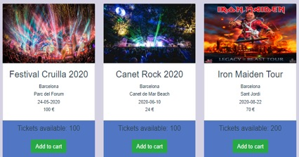
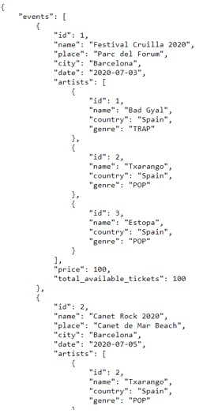
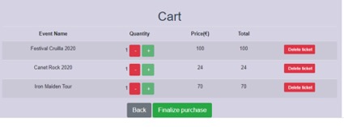

Sessió 4
=========
Bucles
------
Vue permet utilitzar bucles i és molt útil per a llistes. Imagineu-vos que tenim una llista d’espectacles que volem repetir i mostrar la informació de cada espectacle per separat. Per fer-ho, creeu una llista d'epectacles amb algunes propietats a data () - \> return:

```html
shows: [
        {
          name: 'Festival Cruilla 2020',
          artists: [
            {
              'name': 'Bad Gyal'
            },
            {
              'name': 'Txarango'
            },
            {
              'name': 'Estopa'
            }
          ],
          city: 'Barcelona',
          place: 'Parc del Forum',
          date: '2020-07-03',
          price: 100
        },
        {
          name: 'Canet Rock 2020',
          artists: [
            {
              'name': 'Txarango'
            },
            {
              'name': 'Dvicio'
            },
            {
              'name': 'Lola Indigo'
            }
          ],
          city: 'Barcelona',
          place: 'Parc del Forum',
          date: '2020-07-05',
          price: 24
        },
        {
          name: 'Iron Maiden Tour',
          artists: [
            {
              'name': 'Iron Maiden'
            }
          ],
          city: 'Barcelona',
          place: 'Sant Jordi',
          date: '2020-08-22',
          price: 70
        }
      ],
```

Creeu un bucle V-for per visualitzar cada esdeveniment per separat:

```html
<div class="container">
    <div class="row">
      <div class="col-lg-4 col-md-6 mb-4" v-for="(show) in shows" :key="show.id">
        <br>
        <h6>{{ show.name }}</h6>
        <div v-for="(artist) in show.artists" :key="artist.id">
           <h5>{{ artist.name }}</h5>
        </div>
        <h6>{{ show.city }}</h6>
        <h6>{{ show.place }}</h6>
        <h6>{{ show.date }}</h6>
        <h6>{{ show.price }} \euro</h6>
      </div>
    </div>
  </div>
```


### Exercici 1:

Modifiqueu el codi actual per mostrar els esdeveniments de manera estructurada. Una forma
podria ser utilitzar targetes (<https://getbootstrap.com/docs/4.0/components/card/>).
A més, implementeu el botó "Afegeix a la cistella" i afegiu una imatge d'un espectacle que us agradi a cada targeta. Aquest botó també ha d'afegir l'esdeveniment comprat amb la seva informació en una llista de `shows_added:[]` definida a data() i  tenint en compte que per afegir un nou show feu servir aquesta instrucció `this.shows_added.push(show)`. Associeu una funció `addEventToCart` que faci això quan es cliqui al botó.
No us preocupeu pel nombre d’entrades disponibles. Més endavant, gestionarem el nombre de tiquets disponibles on haurem de disminuir el nombre de tiquets comprats.

Obtenir dade d'APIs amb AXIOS
---------
En lloc de declarar una llista d'espectacles, fem servir la nostra API desenvolupada a Flask per GET, POST, PUT i DELETE mitjançant Vue. Per consumir rutes des de Vue, fem servir la biblioteca axios:

	npm install axios@0.21.1 -saves
	
Importeu axios a l'script just després de `<script>`:

```html
<script>
import axios from 'axios'

export default {
```

Executeu l'aplicació Flask i afegiu el codi següent als mètodes:

```html
getShows () {
      const path = 'http://localhost:5000/shows'
      axios.get(path)
        .then((res) => {
          this.shows = res.data.shows
        })
        .catch((error) => {
          console.error(error)
        })
    }
```

On /shows tornarà la llista de tots els shows que ja heu registrat. Per exemple:




A més, afegiu created() sota i fora dels mètodes. Permet que el codi s’executi cada vegada que s’inicialitza la web.

```html
created () {
    this.getShows()
  }
```

D’aquesta manera, podeu obtenir les dades de la vostra API.

###Exercici 2:

Adapteu l'aplicació per mostrar els espectacles consumits a `/shows` i suprimiu la llista de shows creats anteriorment.

Vista de la cistella
--------

En aquesta vista, veurem totes les comandes de l'usuari. A més, l'usuari podrà finalitzar la compra. Aquesta vista es pot definir com a part de Shows.vue, però no en un component nou, només en un condicional per mostrar la part d'Espectacles o la part de la cistella. 



Abans de continuar amb la nostra visualització d'espectacles, implementem un model de compte d'usuari per identificar un usuari i guardar les seves comandes comprades.
En primer lloc, com heu fet anteriorment amb Show o Artist, creeu un model nou
anomenat AccountsModel a la carpeta model en un fitxer 'accounts.py'. En aquest cas, utilitzarem una relació d'un a molts. La taula "Accounts" té les columnes següents:

```python
class AccountsModel(db.Model):  
     __tablename__ = 'accounts'

    username = db.Column(db.String(30), primary_key=True, unique=True, nullable=False)
    password = db.Column(db.String(), nullable=False)
    # 0 not admin/ 1 is admin
    is_admin = db.Column(db.Integer, nullable=False)
    available_money = db.Column(db.Integer)
    orders = db.relationship('OrdersModel', backref='orders', lazy=True) 

    def __init__(self, username, available_money=200, is_admin=0):
        self.username = username
        self.available_money = available_money
        self.is_admin = is_admin
```

No inicialitzarem AccountModel amb una contrasenya. Veurem a les properes sessions per què, però per al proper exercici només heu de tenir una contrasenya falsa: inicialitzeu el camp de la contrasenya a la funció init del AccountModel fent "self.password = 'test'".

### Exercici 3:
1. Creeu un mètode `json()` que retorni en un json els atributs `username`, `is_admin` i `available_money`.

2. Creeu un mètode per desar les dades en db

3. Creeu un mètode per suprimir les dades de db

4. Creeu un usuari nou mitjançant Flask shell i afegiu-lo a db:

		>>> from db import db
  		>>> from models.accounts import AccountsModel
 		>>> test_user=AccountsModel(username='test')
 		>>> db.session.add(test_user)
  		>>> db.session.commit() 

Un cop creat AccountsModel, creem un model i un recurs nous per desar tots els espectacles comprats. L'anomenarem OrdersModel. Camps de la taula de comandes:

```python
class OrdersModel(db.Model): 
     __tablename__ = 'orders' 

    id = db.Column(db.Integer, primary_key=True)
    username = db.Column(db.String(30), db.ForeignKey('accounts.username'), nullable=False                                 
    id_show = db.Column(db.Integer, nullable=False)
    tickets_bought = db.Column(db.Integer, nullable=False)
	
	def __init__(self, id_show, tickets_bought):
	 	self.id_show = id_show
    	self.tickets_bought = tickets_bought
```
I creeu aquests punts finals (endpoints) a `app.py`:

```python
	api.add_resource(Orders, '/order/<string:username>')
	api.add_resource(OrdersList, '/orders')
```

### Exercici 4:

1. Afegiu un camp nou `total_available_tickets` al ShowModels que per defecte sigui el nombre de localitats del lloc on s'està fent i feu les actualitzacions necessàries al constructor i a Show(Resource)
	`total_available_tickets = db.Column(db.Integer)`
 
2. Creeu la classe Orders(Resource) amb els següents mètodes:

    - GET: retorna totes les comandes per nom d'usuari get(self, username)

    - POST: afegeix una nova comanda per nom d'usuari (self, username)
    	 Creeu el nou recurs , on els arguments necessaris 		 siguin:

    		- id_show, type = int, required = True

    		- tickets_bought, type = int, required = True 

        1. Consulteu l'usuari actual: filtreu per nom d'usuari

        2. Consulteu l'esdeveniment actual: filtreu per id_show

        3. Comproveu si l'usuari té prou diners per comprar el bitllet

        4. Comproveu si hi ha entrades disponibles

        5. Actualitzeu les entrades disponibles (- entrades comprades)

        6. Actualitzeu els diners de l'usuari després de comprar els bitllets (-preu * bitllets comprat)

        7. Inicialitzar `OrdersModel(id_show, tickets_bought)`

        8. Afegiu la comanda a la relació d'usuari `user.orders.append(new_order)`

        9. Deseu la comanda, l'espectacle i l'usuari a la BD. **Atenció!** amb les condicions de carrera! Feu una única sessió per fer tots els canvis a la BD en la mateixa transacció. No useu els mètodes save_to_db() dels models, sino feu una única sessió, afegiu tots els canvis, feu el commit i comproveu si es provoca algun error, en aquest cas caldra fer un rollback i tornar-ho a intentar o retornar un error.

        10. Tornar el json de la nova comanda
4. Creeu una classe OrdersList (recurs) per retornar totes les comandes disponibles

Vista taula de la cistella
----------

Ara ja podem tornar a editar el nostre frontend. Fem la taula on l'usuari pot visualitzar la seva comanda i la seva informació. En aquesta taula, podem veure:

1. **Nom de l'espectacle**

2. **Quantitat**: quantitat d'entrades comprades per a aquest espectacle. L'usuari pot interactuar afegint o restant un bitllet amb dos botons. Si la quantitat és 0, l'espectacle desapareix de la llista.

3. **Preu**: preu per bitllet

4. **Total**: suma del preu de totes les entrades

5. **Eliminar entrada**: botó per suprimir l'espectacle, l'espectacle desapareix de la llista

Per crear aquesta taula, podeu utilitzar l'estructura clàssica
(<https://www.w3schools.com/html/html_tables.asp>). `<thead>` conté les capçaleres:

```html
<thead>
<tr>
  <th>Event Name</th>
  <th>Quantity</th>
  <th>Price(\euro)</th>
  <th>Total</th>
  <th></th>
</tr>
</thead>
```

`<body>` en el nostre cas, conté la informació i els botons a
interactuar (augmentar, disminuir)

### Exercici 5: 

1. Creeu una taula amb espectacles i la seva informació

2. Creeu els botons per augmentar i disminuir número d'entrades pels esdeveniments en la cistella i els seus mètodes associats quan es faci click.

Botó de tornar enrere
-----------

Creem un botó per tornar a la vista principal:

1. Creeu una variable anomenada, per exemple, `isShowingCart`. Serà el nostre condicional per mostrar la vista d'Espectacles o de Cistella.

3. Enllaceu la variable creada anteriorment amb un botó nou "Veure cistella" per mostrar la cistella que faci (isShowingCart = True)

4. Enllaça la variable creada anteriorment amb un nou botó "Enrere" que faci (isShowingCart = Fals)

per alternar d'una vista a l'altra, feu servir el v-if   en el `<div>` on es mostri la cistella:
```html
	<div v-if=isShowingCart class...> 
		<h1> Cart </h1>
		...
	</div>
	<div v-else class...>
		...
	</div>	
```

Podeu fer servir v-if en qualsevol tag per que es mostri en cas de ser cert o ocultar-lo en cas de ser fals, per exemple podeu fer que s'activi la taula només si hi ha elements en la taula així:
```html
 <table v-if="shows_added.items.length > 0" class=....>
 </table>
        <p v-else>Your cart is currently empty.</p>
 ```

Qualsevol v-else que poseu buscarà l'últim v-if que hi hagi, i el bloc definit per la condició serà des de l'v-if fins al v-else.

Finalitza el botó de compra
-----

Aquest botó executa un mètode POST que desa totes les files de comanda de la base de dades:

```html
addPurchase (parameters) {
      const path = `http://localhost:5000/order/test
      axios.post(path, parameters)
        .then(() => {
          console.log('Order done')
        })
        .catch((error) => {
          // eslint-disable-next-line
          console.log(error)
          this.getShows()
        })
    },
```
amb els paràmetres:

```html
const parameters = {
          id_show: this.shows_added.items[i].show.id,
          tickets_bought: this.shows_added.items[i].quantity
        }
```
A continuació, hauríem de restablir la llista on emmagatzemem
els esdeveniments per comprar i desactivar el botó finalitzar la compra. L'usuari hauria de veure:


Ara tenim la informació per actualitzar els diners disponibles de l’usuari després de comprar la comanda.

### Exercici 7:

1. Creeu un botó anomenat Finalitzar la compra
2. Creeu un mètode POST per enviar la compra ordenada (POST per fila)

    ```html
    finalizePurchase ()  {
        for (let i = 0; i < this.shows_added.items.length; i += 1) {
            const parameters = {
                id_show: this.shows_added.items[i].show.id,
                tickets_bought: this.shows_added.items[i].quantity
            }
            this.addPurchase(parameters)
        }
     }
    ```

3. Inicialitzar la cistella i desactivar el botó


### Deures:

La funció finalizePurchase està cridant la funció addPurchase per cada ordre que hi ha a la cistella. Això ens pot portar varis problemes, 1er que l'Usuari es quedi sense diners a mitja cistella i 2on que es produiran n peticions consecutives a flask en que es podria entrar en una condició de carrera en la variable de diners disponibles per l'usuari.

1. Per millorar això, en comptes de fer n crides post a order, feu un mètode **post** a OrdersList(Resource) i passeu-li una llista d'ordres per ser afegides a la base dades. En el for del vue afegiu en un json la llista d'ordres i feu una única crida a post per enviar totes les dades de cop. En el backend podeu comprovar que el total de les ordres sigui suficent pels diners de l'usuari.

`api.add_resource(OrdersList, '/orders/<string:username>/')`
	