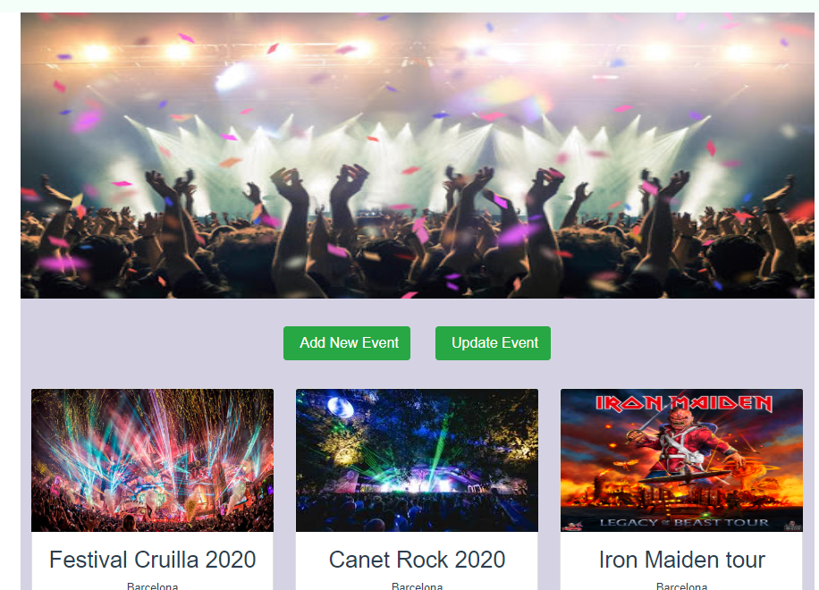
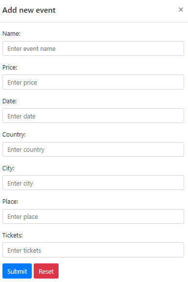
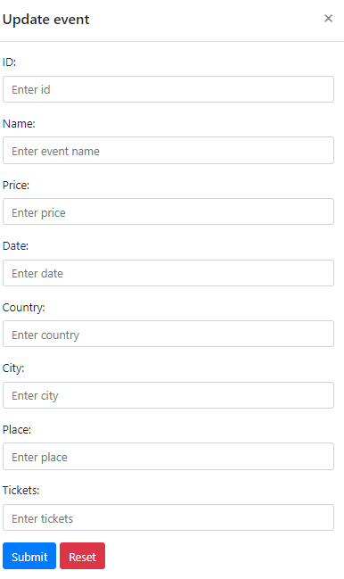
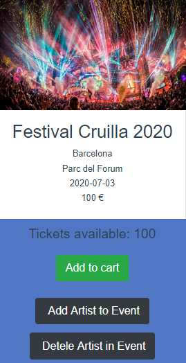
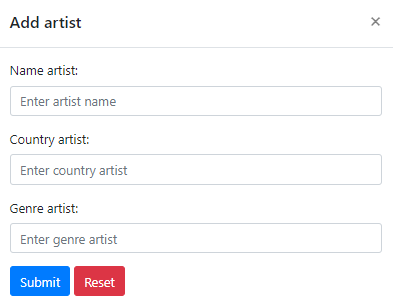
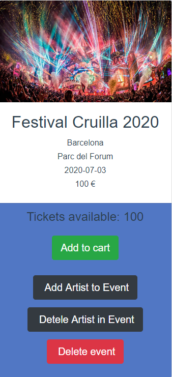
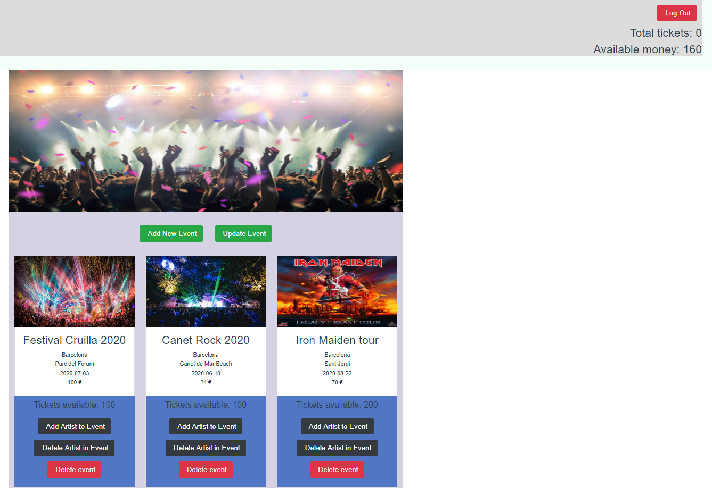
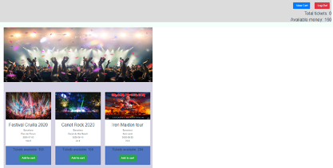

Sessió 6
=========

Creeu un espectacle nou i actualitzeu-lo
------------

Crearem un botó per afegir espectacles nous i un altre per actualitzar-los.



Començant per "Afegeix un espectacle nou", hauríem de cridar a un formulari per recollir les dades tal com hem fet amb el botó "Crea un compte". El vostre formulari s'hauria d'insipirar en un com aquest:



### Exercise 1: 

En el frontend:

1. Creeu un botó "Afegeix un espectacle nou"

2. Creeu un formulari amb la `ref =" addShowModal "` per recopilar les dades mitjançant  Forms de bootstrap:

	```html
  	 <b-modal ref="addEventModal"
            id="event-modal"
            title="Add new event"
            hide-footer>
      <b-form @submit="onSubmit" @reset="onReset" v-if="show">
      <b-form-group  .....
	```

3. Creeu una variable per emmagatzemar les dades recollides que voldreu enviar al backend, per exemple:

	```html
      addShowForm: {
            place: '',
            name: '',
            city: '',
            date: '',
            price: '',
            total_available_tickets: ''
          },    
    ```
    

4. Creeu el mètode **onSubmit** cridat des del botó "Enviar":

	```html
	    onSubmit (evt) {
	          evt.preventDefault()
	          this.$refs.addShowModal.hide()
	          const parameters = {
	            place: this.addShowForm.place,
	            name: this.addShowForm.name,
	            city: this.addShowForm.city,
	            date: this.addShowForm.date,
	            price: this.addShowForm.price,
	            total_available_tickets: this.addShowForm.total_available_tickets
	          }
	          this.addShow(parameters)
	          this.initForm()
	        },      
	``` 
    
    
5. Crea el mètode **addShow(paràmetres)**: hauria de cridar a una sol·licitud POST a <http://localhost:5000/show>. Recordeu afegir paràmetres d'autenticació a la sol·licitud POST, com ara: 

	```html
    axios.post(path, parameters, {
            auth: {username: this.token}
          })        
    ```
    
    Comproveu que en el backend s'hagi d'estar registrat com a administrador en aquest endpoint:
    
    ```html
    @auth.login_required(role=admin)
    ```

	Després d'això, actualitzeu els espectacles disponibles.
	
6. Creeu el mètode `initForm()` per a inicialitzar els paràmetres de `addShowForm`.

7. Crideu `initForm() 'després d'afegir un espectacle.

8. Crea el mètode **onReset** cridat des del botó **Reset** com:

	 ```html
    onReset(evt) {
            evt.preventDefault()
            this.initForm()
            this.show = false
            this.$nextTick(() => {
            this.show = true
            })
          },
     ```
     
El següent botó que hauríem de crear és el botó "Actualitza esdeveniment". En aquest cas, el formulari per recopilar dades hauria de ser el següent:



### Exercise 2: 

1. Creeu un botó "Actualitza l'espectacle"

2. Creeu un formulari amb `ref ="editShowModal"` per recopilar les dades mitjançant Forms de bootstrap

3. Creeu una variable per emmagatzemar les dades recopilades similar al d'abans:

	  ```html
    editShowForm: {
            id: '',
            name: '',
            place: '',
            city: '',
            date: '',
            price: '',
            total_available_tickets: ''
          },
    ```
  
4. Creeu el mètode **onSubmitUpdate** cridat des del botó Submit.

5. Creeu el mètode **updateShow (paràmetres)**. Ha de cridar a una sol·licitud PUT a <http://localhost:5000/show/show_id>, on `show_id = this.editShowForm.id`. Recordeu afegir paràmetres d'autenticació a la sol·licitud PUT.

	```html
    axios.put(path, parameters, {
                auth: {username: this.token}
            })
	```
	
  Comproveu que en el backend s'hagi d'estar registrat com a administrador en aquest endpoint:
    
    ```html
    @auth.login_required(role=admin)
    ```
	
	Després d'això, actualitzeu els espectacles disponibles.
	
6. Afegiu al mètode **initForm ()** els paràmetres de `editShowForm`.

7. Crideu a **initForm ()** després d'actualitzar un espectacle.

8. Creeu el mètode **onResetUpdate** anomenat des del botó Reset.

Afegiu i suprimiu artistes a espectacles
--------------------------------

En aquesta secció, crearem dos botons més per afegir i suprimir artistes en un espectacle. Per tenir una idea del resultat final s'hauria d'inspirar en:



Començant per "Afegeix artista a l'espectacle", hauríem de crear un formulari per introduir els paràmetres del nou artista:



A més d’afegir l’artista a l'espectacle, hem de crear l’artista si no existeix.

### Exercici 3:

1. Creeu un botó "Afegeix artista a l'esdeveniment"
2. Creeu un mètode **showWhereModifyArtist (show)** i crideu-lo cada vegada que premeu el botó "Afegeix artista a l'espectacle". D’aquesta manera, hem desat l’espectacle i també tindrem accés a la informació a tot arreu.
	
	```html
    		showWhereModifyArtist (show) {
                this.show_to_modify = show
                },
    ```
3. Creeu un formulari amb `ref =" addArtistModal "` per recopilar les dades mitjançant Forms de Bootstrap. 

4. Creeu una variable per emmagatzemar les dades recollides:

	```html
    addArtistForm: {
              id: '',
              name: '',
              country: '',
              genre: ''
            },
    ``` 
5. Creeu el mètode **onSubmitAddArtistInShow** cridat des del botó Submit com: 

	```html
    	onSubmitAddArtistInShow (evt) {
                evt.preventDefault()
                this.$refs.addArtistModal.hide()
                const parameters = {
                   name: this.addArtistForm.name,
                   country: this.addArtistForm.country,
                   genre: this.addArtistForm.genre
                }
                this.addNewArtist(parameters)
                },
    ```
 
6. Creeu el mètode **addNewArtist (paràmetres)** per afegir el nou artista a la base de dades si encara no existeix, fent una sol·licitud POST a <http://localhost:5000/artist>. Recordeu afegir paràmetres d'autenticació a la sol·licitud POST:
	
	```html
    axios.post(path, parameters, {
              auth: {username: this.token}
            })
    ```
    Tant en el then com en l'error crideu al **addArtistInShow** amb els paràmetres correctes, per afegir l'artista creat en el show on heu clickat el botó
    
    Comproveu que en el backend s'hagi d'estar registrat com a administrador en aquest endpoint:
    
    ```html
    @auth.login_required(role=admin)
    ```

7. Creeu el mètode **addArtistInShow (paràmetres)** per afegir el nou artista a la base de dades si encara no existeix, fent una sol·licitud POST a <http://localhost:5000/show/show_id/artist>. On 
		
		`show_id = this.show_to_modify.id`

 Recordeu afegir paràmetres d'autenticació a la sol·licitud POST:
	
	```html
    axios.post(path, parameters, {
              auth: {username: this.token}
            })
    ```
    Comproveu que en el backend s'hagi d'estar registrat com a administrador en aquest endpoint:
    
    ```html
    @auth.login_required(role=admin)
    ```
    

8. Afegiu els paràmetres d'"addArtistForm" al mètode **initForm()**

9. Crideu a **initForm ()** després d'afegir artista a l'espectacle

10. Creeu el mètode **onResetAddArtistInEvent** crdiat des del botó Reset

Ara farem el mateix amb "Suprimeix l'artista a l'esdeveniment ".

### Exercici 4:

1. Creeu el botó "Suprimeix l'artista a l'espectacle"

2. Crideu al mètode **eventWhereModifyArtist ()** que heu creat anteriorment, cada vegada que premeu el botó "Suprimeix l'artista a l'espectacle".

3. Creeu un formulari amb `ref =" deleteArtistModal "` per recopilar les dades mitjançant formularis de boostrap.
	
4. Creeu una variable per emmagatzemar les dades recollides

  	```html
    deleteArtistForm: {
              id: '',
              name: ''
            },
    ```
5. Crea el mètode **onSubmitDeleteArtistInShow** cridat des del botó Submit com a:

	```html
    onSubmitDeleteArtistInEvent (evt) {
                evt.preventDefault()
                this.$refs.deleteArtistModal.hide()
                this.deleteArtistInEvent()
                },
    ```
6. Crea el mètode **deleteNewArtist (paràmetres)**. Ha de cridar a una sol·licitud DELETE a <http://localhost:5000/show/show_id/artist/artist_id>. on:

 	-   `show_id = this.show_to_modify.id`

    -   `artist_id = this.artist_id`

    Recordeu afegir paràmetres d'autenticació a la sol·licitud DELETE:
    
  ```html
    axios.delete(path, {
              auth: {username: this.token}
            })
  ```
  Comproveu que en el backend s'hagi d'estar registrat com a administrador en aquest endpoint:
    
    ```html
    @auth.login_required(role=admin)
    ```
    
7. Afegiu els paràmetres de deleteArtistForm al mètode **initForm ()**
8. Crideu a **initForm ()** després de suprimir l'artista de l'espectacle
	
Suprimeix l'esdeveniment
------------

Després d'afegir i actualitzar espectacles, implementem l'opció de supressió d'espectacles. A diferència dels botons d'espectacle nou i actualització d'espectacles, el botó "Suprimeix espectacle" ha de figurar a cada targeta. El resultat final hauria de ser el següent:



### Exercici 5:

1. Creeu un botó "Suprimeix espectacle"
2. Crideu al mètode **removeShow(show.id)**. Aquest mètode ha de cridar a una sol·licitud DELETE a <http://localhost:5000/show/show.id>. Recordeu afegir paràmetres d'autenticació a la sol·licitud POST:
	
	 ```html
    axios.delete(path, {
              auth: {username: this.token}
            })
     ```

	Comproveu que en el backend s'hagi d'estar registrat com a administrador en aquest endpoint:
    
    ```html
    @auth.login_required(role=admin)
    ```

	Després d'això, actualitzeu els espectacles actuals disponibles.
	
	Vista d'administrador i d'usuari
-------------------

Hem de considerar que un usuari normal no tindrà les mateixes funcions que un administrador. Per tant, hem de desactivar algunes funcionalitats per a l'usuari normal. Vegem les dues vistes diferents: 

**Vista ADMINISTRADOR**: 

L’administrador té funcions com:

- Veure espectacles
- Afegeix un espectacle nou

- Actualització de l'espectacle

- Afegeix artista a l'espectacle

- Suprimeix l'artista de l'espectacle

- Esborra l'espectacle

- Tancar sessió



**Vista USUARI SENSE DRETS D'ADMINISTRACIÓ**:

D'altra banda, l'usuari normal té menys funcionalitats:

-   Veure espectacles

-   Afegeix a la cistella

-   Veure cistella

-   Tancar sessió



Activeu i desactiveu aquestes funcions afegint una condició dins del botó. Recordeu que ja tenim un booleà per saber si l'usuari és administrador o no ("is_admin"), per exemple:

```html
<button v-if="logged && is_admin==1"
         style="margin: 15px"
         class="btn btn-dark btn-lg"
         @click="eventWhereModifyArtist(event)"
         v-b-modal.add-artist-modal>
         Add Artist to Event
      </button>
```

### Exercici 6:

1. Desactiveu les funcions "Afegeix un espectacle nou", "Actualitza l'espectacle", "Afegeix artista a l'espectacle", "Suprimeix l'artista a l'espectacle" i les funcions "Suprimeix espectacle" per a un usuari sense drets d'administrador.

2. Desactiveu les funcions "Veure el carretó" i "Afegeix al carretó" per a un administrador.
